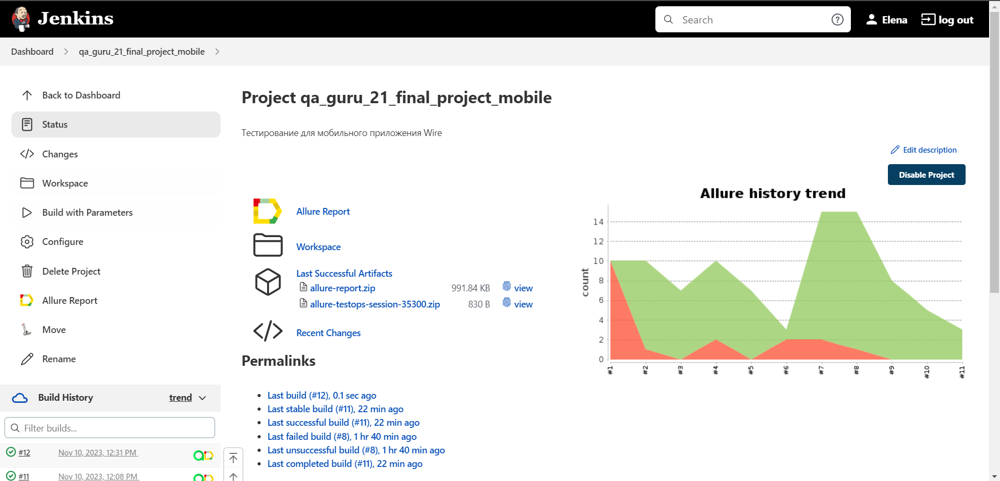
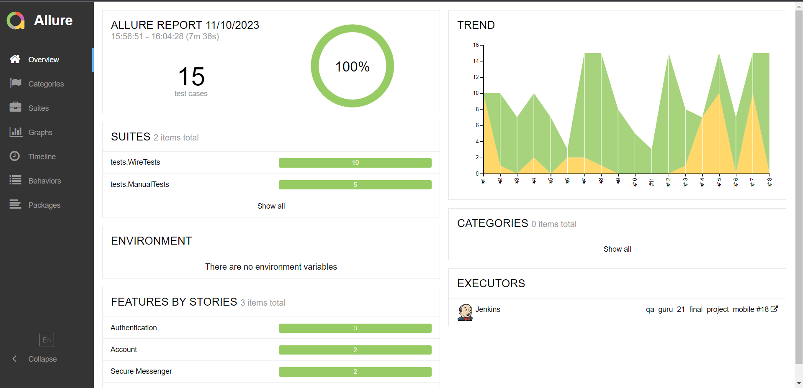
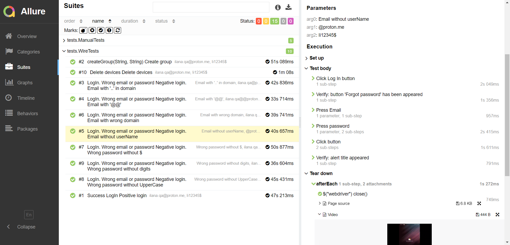
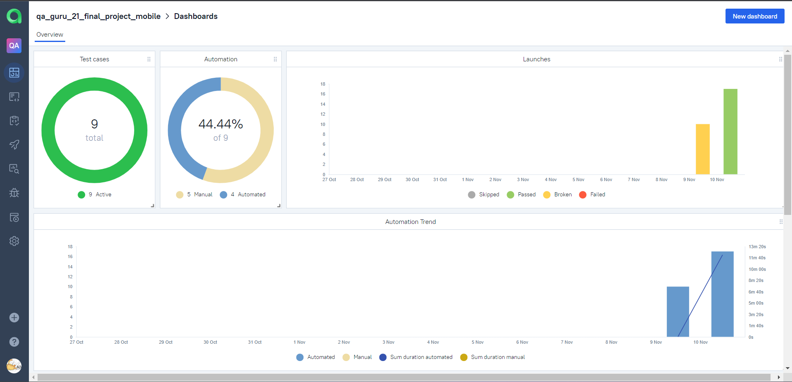
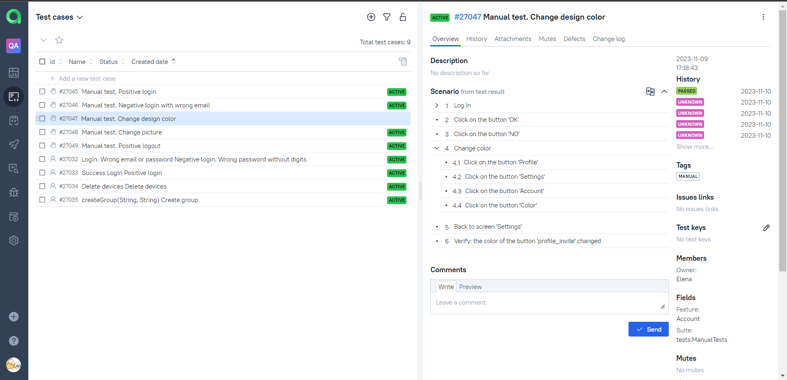
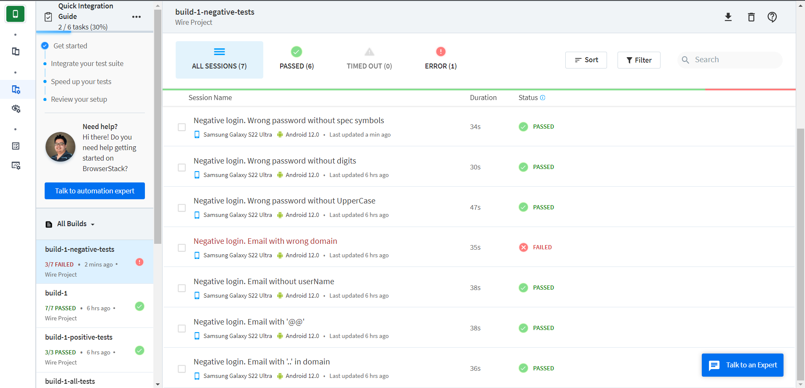
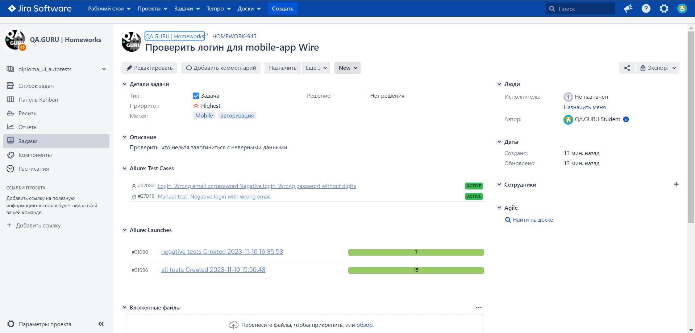
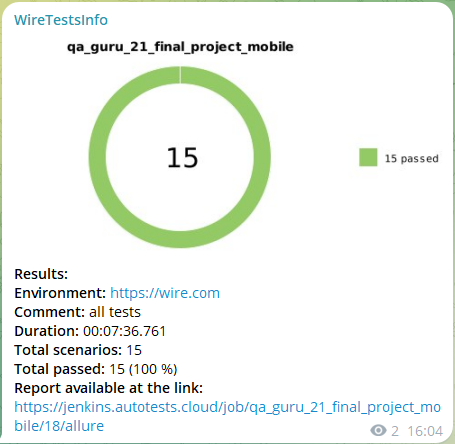

# Проект по автоматизации тестирования для мобильного приложения мессенджера Wire

    

> Просто самый безопасный мессенджер.  
> Самые требовательные организации в мире полагаются на Wire с его постоянным шифрованием для чатов, голосовых и видеоконференций.

## [Содержание](#Содержание)
[Технологии и инструменты](#Технологии-и-инструменты)  
[Реализованные проверки](#Реализованные-проверки)  
[Запуск тестов из терминала](#Запуск-тестов-из-терминала)  
[Сборка в Jenkins](#Сборка-в-Jenkins)   
[Интеграция с Allure Report](#Интеграция-с-Allure-Report)  
[Интеграция с Allure TestOps](#Интеграция-с-Allure-TestOps)  
[Интеграция с Browserstack](#Интеграция-с-Browserstack)  
[Интеграция с Jira](#Интеграция-с-Jira)  
[Уведомление в Telegram](#Уведомление-в-Telegram)  
[Примеры видео выполнения тестов на Browserstack](#Примеры-видео-выполнения-тестов-на-Browserstack)

### Технологии и инструменты

Автотесты написаны на языке `Java` с использованием `JUnit 5`, `Selenide`. Сборщик проекта - `Gradle`. Для удаленного
запуска реализована задача в `Jenkins` с формированием `Allure-отчета` и отправкой результатов в `Telegram` при помощи
бота. Запуск на различных мобильных усройствах осуществляется в `Browserstack`. Так же реализована интеграция
с `Allure TestOps` и `Jira`.

    
    
    
    
    
    
    
    
    
    
    
    
    
    

[Назад к содержанию](#Содержание)

### Реализованные проверки
- Успешная/неуспешная авторизация пользователя
- Удаление старых, уже не используемых устройств, из списка, подключенных к Wire
- Создание группы для общения

[Назад к содержанию](#Содержание)

### Запуск тестов из терминала

#### Локальный запуск

`gradle clean test -DdeviceHost=emulation`

Для запуска локальных тестов на компьютере должны быть установлены `Android Studio`, `Appium Server GUI`
и `Appium Inspector`

#### Удаленный запуск

`gradle clean test -DdeviceHost=browserstack`

[Назад к содержанию](#Содержание)

### Сборка в [Jenkins](https://jenkins.autotests.cloud/job/qa_guru_21_final_project_mobile/)
Для запуска сборки необходимо перейти на страницу проекта [qa_guru_21_final_project_mobile](https://jenkins.autotests.cloud/job/qa_guru_21_final_project_mobile/)
в `Jenkins`, далее в раздел `Build with Parameters`, выбрать необходимые параметры и нажать
кнопку `Build`.

    

[Назад к содержанию](#Содержание)

### Интеграция с [Allure Report](https://jenkins.autotests.cloud/job/qa_guru_21_final_project_mobile/allure/)
При удаленном запуске тестов в `Jenkins`, автоматически генерируется `Allure Report`

##### [Overview](https://jenkins.autotests.cloud/job/qa_guru_21_final_project_mobile/allure/#)

    

##### [Test details](https://jenkins.autotests.cloud/job/qa_guru_21_final_project_mobile/allure/#behaviors/7f547f5110b277a0267f688d919be626/eea69086d2f9ea02/)

    

[Назад к содержанию](#Содержание)

### Интеграция с [Allure TestOps](https://allure.autotests.cloud/project/3766/test-cases/27033?treeId=0)

В отчете `Allure TestOps` можно:

- просматривать созданные тест-кейсы и чек-листы,
- запускать ручные и автоматические тестовые прогоны,
- заводить дефекты,
- собирать статистику о проделанной работе.

##### [Allure TestOps Dashboard](https://allure.autotests.cloud/project/3766/dashboards)

    

##### [Ручные и автоматические тест-кейсы](https://allure.autotests.cloud/project/3766/test-cases/27034?treeId=0)

    

[Назад к содержанию](#Содержание)

### Интеграция с [Browserstack](https://www.browserstack.com/)

Сервис `Browserstack`:
- позволяет прогонять автотесты на реальных устройствах,
- каждый новый build помещает в отдельную папку,
- после прогона можно увидеть продолжительность каждого теста, пометить прошел ли тест или упал,
- также для каждого теста автоматически делается видео запись прогона.  

    

[Назад к содержанию](#Содержание)

### Интеграция с [Jira](https://jira.autotests.cloud/browse/HOMEWORK-945)

Интеграция `Allure TestOps` с `Jira`, позволяет отображать в [задаче](https://jira.autotests.cloud/browse/HOMEWORK-945),
созданной в `Jira`, какие тест-кейсы были написаны в рамках задачи и результат их выполнения.

    

[Назад к содержанию](#Содержание)

### Уведомление в Telegram

После завершения сборки, автоматически отправляется отчет о результатах выполнения тестов в специально созданный `Telegram канал`.

    

[Назад к содержанию](#Содержание)

### Примеры видео выполнения тестов на Browserstack

В отчетах Browserstack и Allure для каждого теста создается не только скриншот, но и видео его прохождения.

    

[Назад к содержанию](#Содержание)